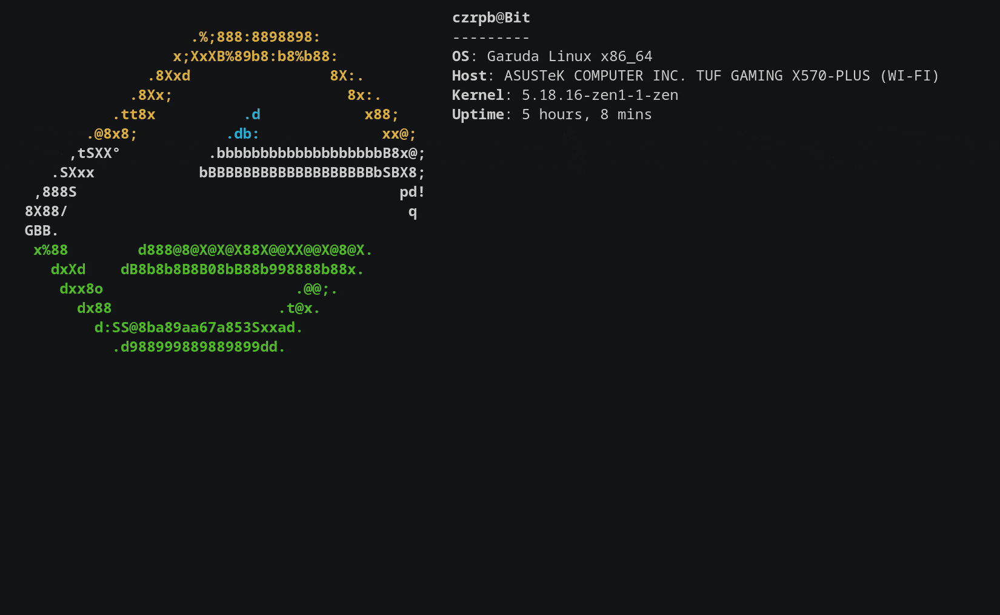
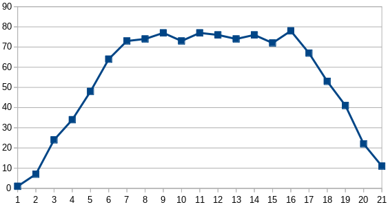

# Parsing `k6`'s JSON metrics output



## Metrics

When `k6 run` is executed, a summary/aggregate of performance statistics are displayed in the terminal.

But, the full/detailed metrics can be gotten:

:information_source: https://k6.io/docs/using-k6/metrics/

## Generating Metrics for a Run

### Command-line Argument: `--out json=<file>`

To generate the metric file in JSON:

> docker run -it --rm -v /tmp:/scripts -v /tmp:/jsonoutput grafana/k6 run `--out json=/jsonoutput/k6out.json` /scripts/testk6.js

:information_source: https://k6.io/docs/results-visualization/json/

### Example

[/workloads/metrics/k6out.json](/workloads/metrics/k6out.json)

## Parsing the JSON Metric File

### Format

The output file's lines are 1 of 2 types:

* `Point`: https://k6.io/docs/results-visualization/json/#point

  A `point` is a single measurement in time.

* `Metric`: https://k6.io/docs/results-visualization/json/#metric

  A `metric` is a type of aggregate or statistic of some measure.

### Example

For the following basic test:

1. Ramp up linearly to 10 VUs in 5seconds
2. For 10seconds keep flat at 10
3. Ramp down linearly to 10 VUs in 5seconds

[/workload/metrics/testk6.js](/workload/metrics/testk6.js)

```javascript
export const options = {
  stages: [
    { duration: '5s', target: 10 },
    { duration: '10s', target: 10 },
    { duration: '5s', target: 0 },
  ]
};
```

[/workloads/metrics/k6out.json](/workloads/metrics/k6out.json)

```json
{"type":"Metric","data":{"name":"http_reqs","type":"counter","contains":"default","thresholds":[],"submetrics":null},"metric":"http_reqs"}
{"type":"Point","data":{"time":"2022-08-13T01:26:26.97176957Z","value":1,"tags":{"scenario":"default","url":"http://test.k6.io","name":"http://test.k6.io","method":"GET","status":"308","proto":"HTTP/1.1","expected_response":"true","group":""}},"metric":"http_reqs"}
{"type":"Metric","data":{"name":"http_req_duration","type":"trend","contains":"time","thresholds":[],"submetrics":[{"name":"http_req_duration{expected_response:true}","suffix":"expected_response:true","tags":{"expected_response":"true"}}]},"metric":"http_req_duration"}
{"type":"Point","data":{"time":"2022-08-13T01:26:26.97176957Z","value":131.205895,"tags":{"expected_response":"true","group":"","scenario":"default","url":"http://test.k6.io","name":"http://test.k6.io","method":"GET","status":"308","proto":"HTTP/1.1"}},"metric":"http_req_duration"}
{"type":"Metric","data":{"name":"http_req_blocked","type":"trend","contains":"time","thresholds":[],"submetrics":null},"metric":"http_req_blocked"}
```

### Requests per Second (rps)

Probably the most basic and desired of metric about a run is knowing the *shape* of the run, ie: the number of requests made in some unit of time.

From the JSON data this can be calculated by:

1. Filtering for `Point` type and the `http_req_duration` metric

   ```json
   {
     "type": "Point",
     "data": {
       "time": "2022-08-13T01:26:26.97176957Z",
       "value": 131.205895,
       "tags": {
         "expected_response": "true",
         "group": "",
         "scenario": "default",
         "url": "http://test.k6.io",
         "name": "http://test.k6.io",
         "method": "GET",
         "status": "308",
         "proto": "HTTP/1.1"
       }
     },
     "metric": "http_req_duration"
   }
   ```

2. In this structure is the the ISO timestamp
3. Convert this timestamp to an integer second (floor or trimming milliseconds)
4. Find the count of these
5. Plot

See: [/workload/metrics/k6.exs](/workload/metrics/k6.exs)

Output:

```
% elixir k6.exs k6out.json http_req_duration
[
  {0, 1},
  {1, 7},
  {2, 24},
  {3, 34},
  {4, 48},
  {5, 64},
  {6, 73},
  {7, 74},
  {8, 77},
  {9, 73},
  {10, 77},
  {11, 76},
  {12, 74},
  {13, 76},
  {14, 72},
  {15, 78},
  {16, 67},
  {17, 53},
  {18, 41},
  {19, 22},
  {20, 11}
]
```

`rps` visualized:

